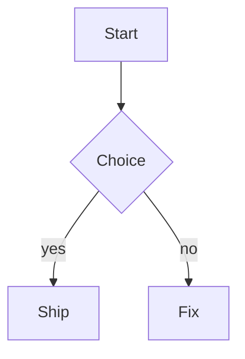

# Mermaid diagrams

A fenced block tagged `mermaid` renders as a diagram in place of its source.

````markdown

````

The ` ```mermaid ` line stays visible as the fold handle, the rest of the block folds away, and the rendered PNG appears below it.

Beside it sits `Open image`, which shows the diagram in its own tab with a `fit / actual size` toggle. Actual size is the size it was rendered at, twice the inline size at the default `mermaid_scale`, and the view scrolls to reach whatever doesn't fit on screen. The block switches to its source at the same time, since the diagram is now in a tab of its own: you end up reading the source and the rendered result side by side instead of two copies of the same picture.

Asking for the same diagram again focuses the tab that's already showing it rather than opening a second copy, and while a block has a tab open its `Show diagram` link reveals that tab: with several diagrams open at once, each block's link brings its own back into view. The tab keeps following that block: edit the source, save, and the tab swaps to the new render on its own. While its tab is open the block stays on source, so you are editing text on one side and watching the diagram on the other. It follows the block's position in the document rather than a file, since an edited diagram hashes to a different cache entry entirely, and it holds the previous render until the new one exists rather than blanking while mermaid works. The tab is a scratch buffer holding one phantom rather than Sublime's image viewer, which draws a checkerboard behind transparent pixels; this way the diagram sits on the color scheme's background, exactly as it does inline.

The state control is a single inline link at the end of that fence line, in the same spot in every state: it reads `Show source` while the diagram shows, `Show diagram` while the source shows, and carries the error plus a `retry` link when a render failed. Clicking the diagram itself is a shortcut for `Show source`. `MarkdownRich: Toggle mermaid diagrams` flips every block in the view at once.

Putting the caret inside a block's body also reveals its source, since a folded region can't be typed into; moving the caret out (or clicking `Show diagram`, which parks the caret on the fence line for you) folds it back.

Diagrams re-render **when you save**, not as you type. A render costs a subprocess or a network round trip, so spending one on every pause in a sentence you're still writing is waste. An edited block therefore keeps showing its source, with a `Show diagram` link if you want the render before saving.

Tilde fences (`~~~mermaid`) and info-string attributes (` ```mermaid title="Flow" `) both work. A mermaid fence nested inside a longer outer fence (like the example above) is sample text, not a diagram, and an unterminated fence is ignored while you're still typing it.

## Rendering backends

Tried in order:

1. **`mmdc`** ([mermaid-cli](https://github.com/mermaid-js/mermaid-cli)), when it is on `PATH` or `mermaid_cli_path` points at it. Fully local, nothing leaves the machine. `PATH` is extended with the usual homebrew / asdf / volta / nvm bin directories first, because a GUI Sublime doesn't inherit a login shell's `PATH`.
2. **[Kroki](https://kroki.io)**, an HTTP diagram-rendering service, when mermaid-cli is missing or fails. This sends the diagram source to `mermaid_remote_endpoint`. Set `mermaid_remote_fallback` to `false` to keep everything local, or point the endpoint at a self-hosted Kroki instance (`docker run -p 8000:8000 yuzutech/kroki` plus the mermaid companion).

Install mermaid-cli with:

```bash
npm install -g @mermaid-js/mermaid-cli
```

If diagrams keep coming from Kroki despite mermaid-cli being installed, the binary on `PATH` is probably a version-manager shim pointing at a runtime that doesn't have it. Check with `mmdc --version`; a failure there shows up verbatim in the diagram's error annotation. Point `mermaid_cli_path` at the real binary, or fix the shim's version selection.

## Theming

`mermaid_theme` and `mermaid_background` both default to `"auto"`, which reads the color scheme's own background:

- the background becomes the diagram's background, so the render blends into the editor instead of sitting in a white box
- the theme becomes `dark` for a dark scheme and `default` for a light one, so diagram text never lands dark-on-dark

The background is `"transparent"` by default, so the render keeps its alpha and the editor shows through, inline and in the diagram tab alike. Set it to `"auto"` to bake the color scheme's background into the file instead, which matters only if you open the cached PNGs somewhere else, or to a fixed color. The theme can be pinned to a mermaid theme name (`"default"`, `"dark"`, `"neutral"`, `"forest"`). Kroki takes no theme flag, so for remote renders the theme is baked into the source as a `%%{init: {"theme": "..."}}%%` directive; a diagram that already carries its own init directive is left alone.

## Configuring mermaid

`mermaid_node_padding` sets the space between a node's text and its border. Mermaid has no global setting for it and names the key differently per diagram type, so the plugin spreads one value across every type that honours one, and its defaults leave label text touching the box edge.

| Diagram type                                                          | Honours it | Key it uses                  |
|-----------------------------------------------------------------------|------------|------------------------------|
| `flowchart`, `class`, `mindmap`, `block`, `timeline`                  | yes        | `padding`                    |
| `sequence`                                                            | yes        | `wrapPadding`                |
| `C4`                                                                  | yes        | `c4ShapePadding`             |
| `state`, `requirement`, `kanban`, `architecture`, `packet`, `journey` | no         | ignores its own padding keys |

Set it to `0` to keep mermaid's defaults everywhere, or override one type through `mermaid_config`, which merges on top.

`mermaid_config` takes mermaid's own configuration, so anything you could write in a `%%{init: ...}%%` directive works as a setting and applies to every diagram. It's merged over the plugin's defaults one level deep, meaning you can set `flowchart.padding` without discarding the other flowchart options.

```json
{
    "mermaid_config": {
        "fontFamily": "Menlo, monospace",
        "flowchart": {"padding": 20, "nodeSpacing": 60, "rankSpacing": 60, "curve": "basis"},
        "sequence": {"actorMargin": 60, "messageMargin": 40, "boxMargin": 12},
        "er": {"entityPadding": 15, "minEntityWidth": 100}
    }
}
```

The options worth knowing:

**Global**

| Option           | Effect                                              |
|------------------|-----------------------------------------------------|
| `fontFamily`     | Font for every label                                |
| `fontSize`       | Base font size                                      |
| `look`           | `classic`, or `handDrawn` for a sketched style      |
| `themeVariables` | Individual theme colors, e.g. `{"primaryColor": …}` |
| `themeCSS`       | CSS injected into the diagram's own stylesheet      |

**`flowchart`**

| Option           | Effect                                            |
|------------------|---------------------------------------------------|
| `padding`        | Space inside a node, around its text              |
| `nodeSpacing`    | Gap between nodes on the same rank                |
| `rankSpacing`    | Gap between ranks                                 |
| `diagramPadding` | Margin around the whole diagram                   |
| `curve`          | Edge shape: `basis`, `linear`, `cardinal`, `step` |
| `wrappingWidth`  | Width at which label text wraps                   |
| `htmlLabels`     | Render labels as HTML, off for plain SVG text     |

**`sequence`**

| Option                              | Effect                                      |
|-------------------------------------|---------------------------------------------|
| `wrapPadding`                       | Space inside a participant box              |
| `actorMargin`                       | Horizontal gap between participants         |
| `messageMargin`                     | Vertical gap between messages               |
| `boxMargin`                         | Padding inside `loop` / `alt` / `opt` boxes |
| `noteMargin`                        | Padding inside notes                        |
| `diagramMarginX` / `diagramMarginY` | Margin around the diagram                   |
| `width` / `height`                  | Minimum participant box size                |
| `wrap`                              | Wrap long message text                      |

**Other types**

| Type    | Options                                                                                               |
|---------|-------------------------------------------------------------------------------------------------------|
| `gantt` | `barHeight`, `barGap`, `topPadding`, `leftPadding`, `gridLineStartPadding`                            |
| `class` | `padding`, `textHeight`, `diagramPadding`                                                             |
| `er`    | `minEntityWidth`, `minEntityHeight`, `diagramPadding`, `layoutDirection` (`entityPadding` is ignored) |
| `pie`   | `textPosition`, `useWidth`                                                                            |

Mermaid's full list is larger; consult [its configuration docs](https://mermaid.js.org/config/schema-docs/config.html) for the rest.

Both renderers honour the config: a local render gets it as a JSON file (`mmdc -c`), and a remote one gets it folded into the diagram source as an init directive, since Kroki takes no config file. A diagram carrying its own `%%{init: ...}%%` overrides everything here, since the author was being specific on purpose.

`mermaid_css_file` points at a CSS file applied to the rendered page (`mmdc -C`), for what the config can't express. Local renders only, since the remote renderer has no equivalent.

Changing either setting changes the cache key, so every diagram re-renders on its next save.

## Caching

Renders are cached under the OS temp dir (`remote_cache_dirname`), keyed by source, theme, background, scale and config, so a diagram is rendered once and then loads instantly.

That key decides which settings cost you a re-render:

| Changing…                                                                                        | Effect                                                |
|--------------------------------------------------------------------------------------------------|-------------------------------------------------------|
| `mermaid_theme`, `mermaid_background`, `mermaid_scale`, `mermaid_node_padding`, `mermaid_config` | new key, so every diagram re-renders on its next save |
| your color scheme (with `"auto"` theme or background)                                            | same, since the resolved values are what get keyed    |
| `mermaid_max_width`, `mermaid_min_height`                                                        | nothing re-renders; these size an existing image      |
| `mermaid_css_file`                                                                               | not keyed: run `MarkdownRich: Clear Cache` by hand    |

`mermaid_scale` is the one with a real trade-off: it multiplies the pixels rendered, so 2 buys a sharp diagram in the tab and on retina displays, and costs roughly four times the cache size of 1.

## Sizing

A diagram is drawn at the size it was rendered, divided by `mermaid_scale`, then fitted to the width `mermaid_max_width` allows. It's a fraction of the view by default (`0.66`), which keeps the inline diagram a readable preview rather than something that dominates the document; whole numbers are pixels, and `0` fills the view. `Open image` on the fence line is the full-size view for anything dense enough to need it.

That alone treats a left-to-right flowchart badly. It comes out wide and shallow, so fitting the width leaves it a couple of centimetres tall with labels too small to read. `mermaid_min_height` grows a short diagram back up until it reaches that height. The width still wins, since overflowing the view would only clip the diagram, and nothing is drawn larger than the pixels actually rendered, since past that it is blur rather than detail. A chart that is wide enough to fill the view on its own is therefore as tall as its shape allows: rewriting it as `flowchart TD` is the only way to make that text bigger.

The cache filename records the scale it was rendered at (mermaid-cli honours `mermaid_scale`, Kroki always renders at 1x), so both backends end up displayed at the same logical size. Renders are written to a temporary file and moved into place, so a partially-written PNG is never displayed.

Remote renders are retried three times with a short pause between attempts, since Kroki's 500s are transient. Failures render as an inline annotation naming what was tried (`mermaid-cli: ...; remote render: ...`) with a retry link, and the source stays visible. See [Recovering from a bad render](../README.md#recovering-from-a-bad-render) for the wider escape hatches.

## Settings

| Key                       | Default              | Description                                                                                      |
|---------------------------|----------------------|--------------------------------------------------------------------------------------------------|
| `render_mermaid`          | `true`               | Fold ```` ```mermaid ```` blocks and render the diagram in their place                           |
| `mermaid_cli_path`        | `""`                 | Path to the `mmdc` binary; empty looks for `mmdc` on the extended `PATH`                         |
| `mermaid_remote_fallback` | `true`               | Render via Kroki when mermaid-cli is missing or fails (sends the diagram source to the endpoint) |
| `mermaid_remote_endpoint` | `"https://kroki.io"` | Kroki base url; point it at a self-hosted instance to keep sources internal                      |
| `mermaid_node_padding`    | `16`                 | Space between a node's text and its border, across every type that supports one                  |
| `mermaid_config`          | `{}`                 | Mermaid's own configuration (padding, spacing, fonts), merged over the plugin defaults           |
| `mermaid_css_file`        | `""`                 | CSS file applied to the rendered page; local renders only                                        |
| `mermaid_theme`           | `"auto"`             | `"auto"` follows the color scheme; or `"default"`, `"dark"`, `"neutral"`, `"forest"`             |
| `mermaid_background`      | `"transparent"`      | Keeps the render's alpha; `"auto"` bakes in the scheme background, or use a color                |
| `mermaid_scale`           | `2`                  | Device pixel ratio for local renders (2 = crisp on retina); the phantom displays at 1/scale      |
| `mermaid_max_width`       | `0.66`               | Inline width: a fraction of the view, pixels above 1, or `0` to fill it                          |
| `mermaid_min_height`      | `200`                | Smallest height a diagram is drawn at, so wide charts stay legible; `0` disables                 |

## Implementation notes

- Blocks are found by walking fences in sequence (`mermaid.find_blocks`), so nesting and unterminated fences are handled without a Markdown parser.
- The source is hidden with `view.fold(body_start..end)` and the phantom is anchored on the still-visible fence line, so it isn't swallowed by the fold.
- Render state is keyed by the block's content hash rather than its position, so toggling one block to source survives edits elsewhere, and an edited diagram re-renders on its own.
- Renders run on a background thread; the view re-renders through `sublime.set_timeout(..., 0)` once the PNG lands.
- Everything that doesn't need a running editor (fence scanning, cache keys, render invocations, theme choice, display sizing) lives in `mermaid.py` and is covered by `tests/test_mermaid.py`.
