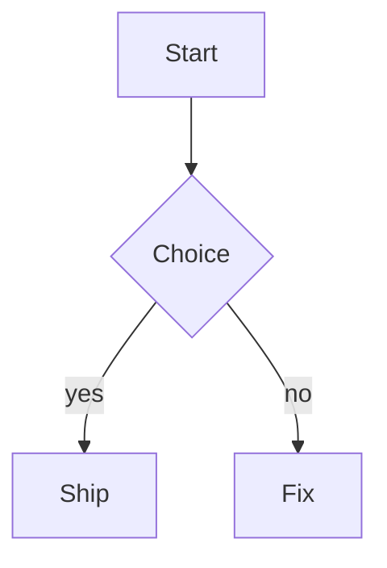

# Mermaid diagrams

A fenced block tagged `mermaid` renders as a diagram in place of its source.

````markdown

````

The ` ```mermaid ` line stays visible as the fold handle, the rest of the block folds away, and the rendered PNG appears below it.

The state control is a single inline link at the end of that fence line, in the same spot in every state: it reads `Show source` while the diagram shows, `Show diagram` while the source shows, and carries the error plus a `retry` link when a render failed. Clicking the diagram itself is a shortcut for `Show source`. `MarkdownRich: Toggle mermaid diagrams` flips every block in the view at once.

Putting the caret inside a block's body also reveals its source, since a folded region can't be typed into; moving the caret out (or clicking `Show diagram`, which parks the caret on the fence line for you) folds it back.

Tilde fences (`~~~mermaid`) and info-string attributes (` ```mermaid title="Flow" `) both work. A mermaid fence nested inside a longer outer fence (like the example above) is sample text, not a diagram, and an unterminated fence is ignored while you're still typing it.

## Rendering backends

Tried in order:

1. **`mmdc`** ([mermaid-cli](https://github.com/mermaid-js/mermaid-cli)), when it is on `PATH` or `mermaid_cli_path` points at it. Fully local, nothing leaves the machine. `PATH` is extended with the usual homebrew / asdf / volta / nvm bin directories first, because a GUI Sublime doesn't inherit a login shell's `PATH`.
2. **[Kroki](https://kroki.io)**, an HTTP diagram-rendering service, when mermaid-cli is missing or fails. This sends the diagram source to `mermaid_remote_endpoint`. Set `mermaid_remote_fallback` to `false` to keep everything local, or point the endpoint at a self-hosted Kroki instance (`docker run -p 8000:8000 yuzutech/kroki` plus the mermaid companion).

Install mermaid-cli with:

```bash
npm install -g @mermaid-js/mermaid-cli
```

If diagrams keep coming from Kroki despite mermaid-cli being installed, the binary on `PATH` is probably a version-manager shim pointing at a runtime that doesn't have it. Check with `mmdc --version`; a failure there shows up verbatim in the diagram's error annotation. Point `mermaid_cli_path` at the real binary, or fix the shim's version selection.

## Theming

`mermaid_theme` and `mermaid_background` both default to `"auto"`, which reads the color scheme's own background:

- the background becomes the diagram's background, so the render blends into the editor instead of sitting in a white box
- the theme becomes `dark` for a dark scheme and `default` for a light one, so diagram text never lands dark-on-dark

Set either to a fixed value to opt out: a mermaid theme name (`"default"`, `"dark"`, `"neutral"`, `"forest"`) and a color or `"transparent"`. Kroki takes no theme flag, so for remote renders the theme is baked into the source as a `%%{init: {"theme": "..."}}%%` directive; a diagram that already carries its own init directive is left alone.

## Caching

Renders are cached under the OS temp dir (`remote_cache_dirname`), keyed by source + theme + background + scale, so a diagram is rendered once and then loads instantly, and changing the color scheme re-renders it.

The cache filename records the scale it was rendered at (mermaid-cli honours `mermaid_scale`, Kroki always renders at 1x), so both backends end up displayed at the same logical size. Renders are written to a temporary file and moved into place, so a partially-written PNG is never displayed.

Failures render as an inline annotation naming what was tried (`mermaid-cli: ...; remote render: ...`) with a retry link, and the source stays visible. See [Recovering from a bad render](../README.md#recovering-from-a-bad-render) for the wider escape hatches.

## Settings

| Key                       | Default              | Description                                                                                      |
|---------------------------|----------------------|--------------------------------------------------------------------------------------------------|
| `render_mermaid`          | `true`               | Fold ```` ```mermaid ```` blocks and render the diagram in their place                           |
| `mermaid_cli_path`        | `""`                 | Path to the `mmdc` binary; empty looks for `mmdc` on the extended `PATH`                         |
| `mermaid_remote_fallback` | `true`               | Render via Kroki when mermaid-cli is missing or fails (sends the diagram source to the endpoint) |
| `mermaid_remote_endpoint` | `"https://kroki.io"` | Kroki base url; point it at a self-hosted instance to keep sources internal                      |
| `mermaid_theme`           | `"auto"`             | `"auto"` follows the color scheme; or `"default"`, `"dark"`, `"neutral"`, `"forest"`             |
| `mermaid_background`      | `"auto"`             | `"auto"` uses the color scheme's background; or a color, or `"transparent"`                      |
| `mermaid_scale`           | `2`                  | Device pixel ratio for local renders (2 = crisp on retina); the phantom displays at 1/scale      |
| `mermaid_max_width`       | `800`                | Width cap for the displayed diagram                                                              |

## Implementation notes

- Blocks are found by walking fences in sequence (`mermaid.find_blocks`), so nesting and unterminated fences are handled without a Markdown parser.
- The source is hidden with `view.fold(body_start..end)` and the phantom is anchored on the still-visible fence line, so it isn't swallowed by the fold.
- Render state is keyed by the block's content hash rather than its position, so toggling one block to source survives edits elsewhere, and an edited diagram re-renders on its own.
- Renders run on a background thread; the view re-renders through `sublime.set_timeout(..., 0)` once the PNG lands.
- Everything that doesn't need a running editor (fence scanning, cache keys, render invocations, theme choice, display sizing) lives in `mermaid.py` and is covered by `tests/test_mermaid.py`.
